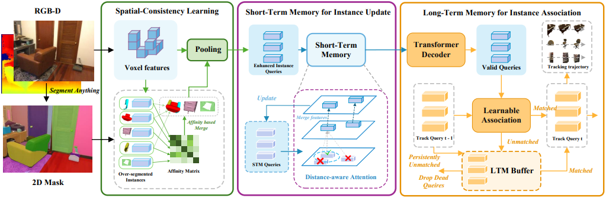

<div align="center">
  <h1>AutoSeg3D [NeurIPS 2025]</h1>
  <h3>
    <a href="https://arxiv.org/abs/2509.23931" target="_blank" rel="noopener">
      Online Segment Any 3D Thing as Instance Tracking
    </a>
  </h3>
  <p>
    <p>
  <a href="https://veritas12.github.io/" target="_blank" rel="noopener">Hanshi Wang</a>,
  <a href="" target="_blank" rel="noopener">Zijian Cai</a>,
  <a href="https://nlpr.ia.ac.cn/users/gaojin/index.htm" target="_blank" rel="noopener">Jin Gao</a>,
  <a href="https://people.ucas.ac.cn/~huweiming" target="_blank" rel="noopener">Weiming Hu</a>,
  <a href="" target="_blank" rel="noopener">Ke Wang</a>,
  <a href="https://zhipengzhang.cn/" target="_blank" rel="noopener">Zhipeng Zhang</a>
</p>
  </p>
    
  </p>
  <p>
    <sup>*</sup>This work was completed during Hanshi’s remote internship at AutoLab, SJTU.
    <!-- <sup>†</sup>Corresponding author. -->
  </p>

</div>


## 🔥 News

[2025.9.18] AutoSeg3D is accepted by NeurIPS 2025.

## 👁️ Overview
Online, real-time, and fine-grained 3D segmentation constitutes a fundamental capability for embodied intelligent agents to perceive and comprehend their operational environments. Recent advancements employ predefined object queries to aggregate semantic information from Vision Foundation Models (VFMs) outputs that are lifted into 3D point clouds, facilitating spatial information propagation through inter-query interactions. Nevertheless, perception, whether human or robotic, is an inherently dynamic process, rendering temporal understanding a critical yet overlooked dimension within these prevailing query-based pipelines. This deficiency in temporal reasoning can exacerbate issues such as the over-segmentation commonly produced by VFMs, necessitating more handcrafted post-processing. Therefore, to further unlock the temporal environmental perception capabilities of embodied agents, our work reconceptualizes online 3D segmentation as an instance tracking problem (AutoSeg3D). Our core strategy involves utilizing object queries for temporal information propagation, where long-term instance association promotes the coherence of features and object identities, while short-term instance update enriches instant observations. Given that viewpoint variations in embodied robotics often lead to partial object visibility across frames, this mechanism aids the model in developing a holistic object understanding beyond incomplete instantaneous views. Furthermore, we introduce spatial consistency learning to mitigate the fragmentation problem inherent in VFMs, yielding more comprehensive instance information for enhancing the efficacy of both long-term and short-term temporal learning. The temporal information exchange and consistency learning facilitated by these sparse object queries not only enhance spatial comprehension but also circumvent the computational burden associated with dense temporal point cloud interactions. Our method establishes a new state-of-the-art, surpassing ESAM by 2.8 AP on ScanNet200 and delivering consistent gains on ScanNet, SceneNN, and 3RScan datasets, corroborating that identity-aware temporal reasoning is a crucial, previously underemphasized component for robust 3D segmentation in real-time embodied intelligence.

## Method 

Method Pipeline:


## Getting Started
For environment setup and dataset preparation, please follow:
* [Installation](./docs/installation.md)
* [Dataset Preparation](./docs/dataset_preparation.md)

For training and evaluation, please follow:
* [Train and Evaluation](./docs/run.md)

## Main Results
We provide the checkpoints for quick reproduction of the results reported in the paper.

**Class-agnostic 3D instance segmentation results on ScanNet200 dataset:**

|  Method  |   Type  |     VFM     |  AP  | AP@50 | AP@25 | FPS |
|:--------:|:-------:|:-----------:|:----:|:-----:|:-----:|:---------:|
| [SAMPro3D](https://github.com/GAP-LAB-CUHK-SZ/SAMPro3D) | Offline |     [SAM](https://github.com/facebookresearch/segment-anything)     | 18.0 |  32.8 |  56.1 |     --    |
|   [SAI3D](https://github.com/yd-yin/SAI3D)  | Offline | [SemanticSAM](https://github.com/UX-Decoder/Semantic-SAM) | 30.8 |  50.5 |  70.6 |     --    |     --    |
|   [SAM3D](https://github.com/Pointcept/SegmentAnything3D)  |  Online |     SAM     | 20.6 |  35.7 |  55.5 | 0.4  |
|  ESAM |  Online |   [FastSAM](https://github.com/CASIA-IVA-Lab/FastSAM)   | 43.4 |  65.4 |  80.9 |   10.6 |
|  AutoSeg3D |  Online |   [FastSAM](https://github.com/CASIA-IVA-Lab/FastSAM)   | **46.2** |  **67.9** |  **81.7** |   10.1   |


## TODO
Our method is built on the ESAM codebase and also inherits several unresolved legacy issues:

1. How to generate more effective and more consistent training and testing data. During dataset generation, the point cloud is randomly sampled to 20,000 points, for example in `data/scannet-sv/load_scannet_sv_data_v2_fast.py` with `xyz_all = random_sampling(xyz_all, 20000)`. As a result, the sampled data differs each time, which affects training and evaluation performance. We previously tried farthest point sampling and uniform sampling, but neither worked well, so we still use the original random sampling.

2. How to make model training more stable. The model uses BatchNorm extensively during training, which makes training unstable. The model performance can change drastically within just a few training steps. We tried operations such as `replace_bn_with_ln` in `oneformer3d/dq_utils.py` to replace BatchNorm with LayerNorm. Training becomes more stable, but the final performance drops, so we still use the original approach.

## 🎟️ License

This project is released under the [Apache 2.0 license](LICENSE).

## 🎉 Acknowledgement

AutoSeg3D uses code from a few open source repositories. Without the efforts of these folks (and their willingness to release their implementations), AutoSeg3D would not be possible. We thanks these authors for their efforts!
- [Oneformer3D](https://github.com/oneformer3d/oneformer3d)
- [Online3D](https://github.com/xuxw98/Online3D)
- [ScanNet](https://github.com/ScanNet/ScanNet)
- [ESAM](https://github.com/xuxw98/ESAM)

## Citation
```
@inproceedings{wangonline,
  title={Online Segment Any 3D Thing as Instance Tracking},
  author={Hanshi Wang, Zijian Cai, Jin Gao, Yiwei Zhang, Weiming Hu, Ke Wang, Zhipeng Zhang},
  booktitle={The Thirty-ninth Annual Conference on Neural Information Processing Systems}
}
```
